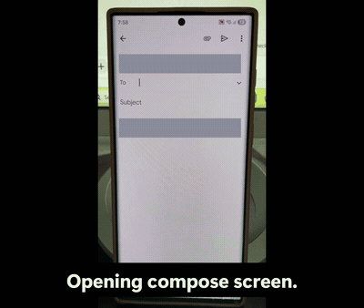

<div align="center">

# 🔮 Lucy

### Your screen-aware AI companion for Android

**Lucy sees your screen, understands what's on it, and taps, types and swipes for you — all from a voice command.**

[](https://github.com/alzin/lucy-screen-agent/releases/latest)
[](https://github.com/alzin/lucy-screen-agent/releases)
[](https://github.com/alzin/lucy-screen-agent/actions/workflows/ci.yml)
[](LICENSE)
[](https://flutter.dev)
[](https://developer.android.com)
[](https://ai.google.dev)
[](CONTRIBUTING.md)
[](https://ko-fi.com/alzin)

<a href="https://github.com/alzin/lucy-screen-agent/releases/latest/download/lucy-latest.apk"></a>

[Download](#-download--install) · [Quick Start](#-quick-start) · [How It Works](#-how-it-works) · [Contributing](CONTRIBUTING.md) · [Troubleshooting](#-troubleshooting)

</div>

---

<div align="center">

### 🎬 Lucy in action



> *"There's an e-mail called 'my manager' in my e-mail list. I want you to send an
> e-mail with the subject 'Today's agenda' mentioning the team meeting at 10 AM."*

Lucy finds the contact, opens the compose screen, fills in the recipient, subject
and body, and sends it. Every tap and keystroke is hers.

**[▶ Watch the full 68-second demo](https://github.com/alzin/lucy-screen-agent/raw/main/docs/media/lucy-demo.mp4)** *(MP4, 2.8 MB)*

</div>

---

> [!IMPORTANT]
> Lucy is an **experimental research project**. To work, she needs two of the most powerful permissions Android offers: **screen capture** and an **accessibility service** that can tap and type on your behalf. Read [Privacy & Security](#-privacy--security) before you install, and prefer a spare or test device.

---

## 📖 Table of Contents

- [What is Lucy?](#-what-is-lucy)
- [Features](#-features)
- [Download & Install](#-download--install)
- [How It Works](#-how-it-works)
- [Requirements](#-requirements)
- [Quick Start](#-quick-start)
- [Using Lucy](#-using-lucy)
- [Building & Releasing](#-building--releasing)
- [Project Structure](#-project-structure)
- [Troubleshooting](#-troubleshooting)
- [Privacy & Security](#-privacy--security)
- [Roadmap](#-roadmap)
- [Contributing](#-contributing)
- [Support the Project](#-support-the-project)
- [License](#-license)

---

## 🔮 What is Lucy?

Most voice assistants are limited to the apps their vendor integrated with. Lucy takes a different approach: instead of using APIs, **she uses the phone the way you do**.

Say *"Open WhatsApp and send Sarah a message saying I'm running late."* Lucy will:

1. 👂 Transcribe your voice
2. 📸 Take a screenshot of whatever is currently on screen
3. 🌲 Read the Android **accessibility tree** — every button, label and text field with exact pixel bounds
4. 🤖 Send the screenshot **and** the UI tree to Google Gemini, which replies with a single next action
5. ⚡ Execute that action through the accessibility service — a real tap, a real keystroke
6. 🔁 Take a fresh screenshot and repeat until the task is done
7. 🔊 Speak the result back to you, in your language

Because Lucy works at the screen level, she works with **any app on your phone** — no integration required.

### Who Lucy is for

Lucy started with a simple problem: **driving**. On a long drive you constantly want small things from your phone — reply to a message, skip to another playlist, re-route to a petrol station — and every one of them normally means picking the phone up. Lucy lets you ask out loud and keep both hands on the wheel.

That turned out to be one case out of several. The common thread is *your hands are busy, or using them is hard*:

| | |
|---|---|
| 🚗 **Driving** | Reply, navigate and change music by voice, without reaching for the phone. |
| ♿ **Limited dexterity** | Tremor, arthritis, RSI, paralysis, or a temporary cast — Lucy does the tapping. Screen readers describe a screen; Lucy actually operates it. |
| 👩‍🍳 **Hands full or dirty** | Cooking, workshop, gardening, gloves in winter, carrying a child or the shopping. |
| 👴 **Unfamiliar with the phone** | Say what you want instead of hunting through five levels of settings menus. |
| 🔁 **Tedious multi-step chores** | Anything buried eight taps deep across three apps becomes one sentence. |
| 🧩 **Apps with no automation** | No API, no Shortcuts support, no integration? Doesn't matter — Lucy drives the UI itself. |

> [!WARNING]
> Lucy is a hands-free convenience, **not a safety device**. She is experimental and can act on the wrong element. If you use her while driving, set the command running before you move off and keep your eyes on the road — never read or correct her mid-drive. Obey your local road traffic laws; in many countries, including Japan, operating or looking at a phone screen while the vehicle is moving is an offence regardless of how the phone is controlled.

---

## ✨ Features

| | |
|---|---|
| 🗣️ **Voice-driven** | Speech-to-text in, text-to-speech out. No typing required. |
| 👁️ **Screen-aware** | Combines a JPEG screenshot with a structured accessibility tree, so the model sees *and* reads the screen. |
| 🎯 **No hallucinated taps** | The model taps elements **by ID**, never by guessed coordinates. Real pixel bounds are resolved on the Dart side from the accessibility tree. |
| 🌍 **Trilingual** | English 🇬🇧, Japanese 🇯🇵 and Arabic 🇸🇦 — with language detection and matching TTS/STT locales. |
| 🔄 **Agentic loop** | Observe → decide → act → re-observe, up to 50 steps per command. |
| 🛑 **Always interruptible** | A persistent "Stop Lucy" notification cancels the agent instantly, even while she's inside another app. |
| 🎨 **Live transcript** | Every screenshot, action and reply is shown in a scrollable conversation view. |
| 🔑 **Bring your own key** | Your Gemini API key stays on your device. No backend, no telemetry, no account. |

---

## 📥 Download & Install

Every release ships a ready-to-install APK. You don't need Flutter, Android Studio,
or a computer at all — just your phone.

<div align="center">

<a href="https://github.com/alzin/lucy-screen-agent/releases/latest/download/lucy-latest.apk"></a>

</div>

That link never changes and always serves the **newest stable build**. If you want a
smaller download or a specific version, pick one from the
[Releases page](https://github.com/alzin/lucy-screen-agent/releases):

| File | Who it's for |
|---|---|
| `lucy-latest.apk` | The newest stable build, always at the same URL. Installs on any device. |
| `lucy-vX.Y.Z-arm64-v8a.apk` | **Most people** — any Android phone from roughly 2017 onwards. Smallest download. |
| `lucy-vX.Y.Z-universal.apk` | Every CPU variant in one file. Larger, but installs anywhere. |
| `lucy-vX.Y.Z-armeabi-v7a.apk` | Older 32-bit phones. |
| `lucy-vX.Y.Z-x86_64.apk` | Emulators and x86 tablets. |

Each release also attaches `SHA256SUMS.txt` if you'd like to verify what you downloaded.

### Installing the APK

1. Tap the downloaded `.apk` — from your notification shade, or in **Files → Downloads**.
2. Android asks whether to allow installs from your browser or file manager. Allow it (**Settings → Install unknown apps**), then tap **Install**.
3. Play Protect may warn that the developer is unknown. That's expected for any app not distributed through the Play Store — tap **Install anyway** if you're happy to proceed.

### Then three more steps

Installing is only the beginning; Lucy is inert until she has her permissions and a key. The app walks you through each one:

| | | Where |
|---|---|---|
| ♿ | Enable Lucy's **accessibility service** — this is how she taps and types | [Step 8](#-quick-start) |
| 📸 | Grant **screen capture** when the mic button asks | [Step 9](#-quick-start) |
| 🔑 | Paste a free **Gemini API key** from [AI Studio](https://aistudio.google.com/app/apikey) | [Steps 6–7](#-quick-start) |

> [!WARNING]
> Release APKs are currently signed with a **debug key**, so the signature isn't stable between builds. If you already have Lucy installed, **uninstall her before installing a newer version** — otherwise Android refuses the update with `INSTALL_FAILED_UPDATE_INCOMPATIBLE`. See [docs/RELEASING.md](docs/RELEASING.md#signing).

Would rather build it yourself and read the code first? That's the [Quick Start](#-quick-start) below — very reasonable, given what Lucy is allowed to do.

---

## 🧠 How It Works


### The two sources of truth

Vision alone is unreliable for UI automation — models guess coordinates and miss by 40 pixels. Lucy solves this by giving Gemini **both** a picture and a map:

```jsonc
// What Gemini receives alongside the screenshot
{
  "package": "com.whatsapp",
  "elements": [
    { "id": 5, "type": "Button", "text": "Send", "clickable": true,
      "bounds": { "cx": 1012, "cy": 2180, "w": 120, "h": 120 } },
    { "id": 6, "type": "EditText", "desc": "Type a message", "editable": true,
      "bounds": { "cx": 520, "cy": 2180, "w": 860, "h": 120 } }
  ]
}
```

Gemini replies with `{"type": "tap", "element": 5}` — an **ID**, not a coordinate. Lucy looks up the real bounds and dispatches a gesture there. This single design choice is what makes the agent reliable.

### Available actions

| Action | Parameters | Effect |
|---|---|---|
| `open_app` | `package` | Launch an app by package name |
| `tap` | `element` | Tap the accessibility element with that ID |
| `type` | `text` | Type into the focused input field |
| `swipe` | `startX`, `startY`, `endX`, `endY` | Scroll or swipe |
| `back` | — | Press the system back button |
| `home` | — | Press the system home button |
| `wait` | `ms` | Pause before the next observation |

After each action Lucy waits for the screen to actually settle — a package change, a UI-tree change, or a newly focused text field — instead of sleeping a fixed amount of time.

---

## 📋 Requirements

| | Minimum | Notes |
|---|---|---|
| **Flutter** | Dart SDK `^3.11.1` | Verified on Flutter `3.47.1` / Dart `3.13.1` |
| **Android device** | Android 7.0 (API 24) | Targets API 36. **A physical device is strongly recommended** — emulators often lack a usable STT/TTS engine |
| **JDK** | 17 | Bundled with recent Android Studio |
| **Gemini API key** | free tier works | Get one at [aistudio.google.com](https://aistudio.google.com/app/apikey) |

> [!NOTE]
> **Android only.** Screen capture and the action layer are implemented in Kotlin against Android APIs. There is no iOS target — iOS does not permit this kind of system-wide control.

---

## 🚀 Quick Start

### Step 1 — Install Flutter

If you don't have Flutter yet, follow the [official install guide](https://docs.flutter.dev/get-started/install), then verify your setup:

```bash
flutter doctor
```

Make sure the **Android toolchain** row has a green check. Everything else (iOS, web, desktop) is irrelevant for Lucy.

### Step 2 — Clone the repository

```bash
git clone https://github.com/alzin/lucy-screen-agent.git
```

```bash
cd lucy-screen-agent
```

### Step 3 — Install dependencies

```bash
flutter pub get
```

### Step 4 — Connect your Android device

1. On your phone, open **Settings → About phone** and tap **Build number** seven times to unlock Developer options.
2. Go to **Settings → Developer options** and enable **USB debugging**.
3. Plug the phone into your computer and accept the debugging prompt.
4. Confirm your computer can see it:

```bash
flutter devices
```

### Step 5 — Run the app

```bash
flutter run
```

The first build downloads Gradle dependencies and can take several minutes. Later runs are much faster.

### Step 6 — Get a Gemini API key

1. Open [Google AI Studio](https://aistudio.google.com/app/apikey).
2. Sign in and click **Create API key**.
3. Copy the key — it starts with `AIza...`.

### Step 7 — Add your key to Lucy

In the app, tap the 🔑 **key icon** in the top bar, paste your key and hit **Save**. It is stored locally with `shared_preferences` and never leaves your device except in requests to Google's Gemini API.

### Step 8 — Enable the accessibility service

Lucy cannot start without this — it's how she taps and types.

1. The app shows an **"Accessibility Required"** screen on first launch. Tap **Open Settings**.
2. Navigate to **Installed apps** (wording varies by manufacturer) **→ Lucy**.
3. Toggle it **on** and accept the system warning.
4. Return to Lucy with the back button — she detects the change automatically.

### Step 9 — Grant screen capture

Tap the 🎤 **microphone button**. Android shows a **"Start recording or casting?"** dialog — tap **Start now**. This grants the `MediaProjection` permission Lucy uses to screenshot.

### Step 10 — Talk to her

Say something like:

> *"Open the calculator and work out 47 times 12."*

Watch the conversation view fill up with screenshots and actions. 🎉

---

## 🎮 Using Lucy

### Example commands

| | Command |
|---|---|
| 📱 | *"Open YouTube and search for lofi hip hop."* |
| ⚙️ | *"Go to settings and turn on Bluetooth."* |
| 👀 | *"What's on my screen right now?"* |
| 💬 | *"Open WhatsApp and message Mom that I'll call tonight."* |
| ⏰ | *"Set an alarm for 7 in the morning."* |

Lucy asks *"Do you need any further help?"* after each completed task. Answer **"no"** (or "stop", "nothing") and she shuts down cleanly.

### Switching language 🌍

Tap the 🌐 **language selector** in the top bar to pick **English**, **日本語** or **العربية**. This sets the speech-recognition locale.

Lucy also **detects the language you actually spoke** and replies in it — the AI tags each response with a language code, and the app switches its TTS voice and follow-up prompts to match. Your choice persists across restarts.

### Stopping the agent 🛑

Three ways, in order of urgency:

1. **The red stop button** in the app — tap the mic button while she's running.
2. **The "Stop Lucy" notification** — swipe down from anywhere, even inside another app, and tap **Stop Lucy**. This is the one you want when she's off doing something in a different app.
3. **Force-stop the app** from Android settings — the nuclear option.

Lucy also stops herself automatically after **50 steps** on a single command, so she can never loop forever.

---

## 📦 Building & Releasing

### Published releases are automatic

Nobody builds or uploads an APK by hand. [`.github/workflows/release.yml`](.github/workflows/release.yml) watches `main` and reads the `version:` in [`pubspec.yaml`](pubspec.yaml). When the semantic part — everything before the `+` — has no matching `vX.Y.Z` tag yet, it analyzes, tests, builds and publishes a GitHub Release with every APK attached.

So the version bump is the trigger, not the merge: merges that leave it alone produce no release, and bumping only the build number after the `+` doesn't either. Full details, including how to cut one, live in **[docs/RELEASING.md](docs/RELEASING.md)**.

### Building a release APK locally

```bash
flutter build apk --release
```

The APK lands in `build/app/outputs/flutter-apk/app-release.apk`. Without a keystore this is signed with the debug key — fine for testing on your own device, not for distribution.

<details>
<summary><b>Signing it with your own key</b></summary>

**1. Create a keystore**

```bash
keytool -genkey -v -keystore lucy-release.jks -keyalg RSA -keysize 2048 -validity 10000 -alias lucy
```

**2. Create `android/key.properties`**

```properties
storePassword=<your store password>
keyPassword=<your key password>
keyAlias=lucy
storeFile=<absolute path to lucy-release.jks>
```

Build again and Gradle picks it up automatically.

> [!WARNING]
> `key.properties`, `*.jks` and `*.keystore` are in `.gitignore`. **Never commit them.** Anyone with your keystore can publish updates impersonating your app.

To sign the *published* releases too, the same keystore goes into four repository secrets — see [docs/RELEASING.md](docs/RELEASING.md#signing).

</details>

<details>
<summary><b>Building an App Bundle for the Play Store</b></summary>

```bash
flutter build appbundle --release
```

</details>

---

## 📁 Project Structure

```
lucy-screen-agent/
├── lib/
│   ├── main.dart                          # App entry point, theme, LucyApp widget
│   ├── screens/
│   │   └── home_screen.dart               # Conversation UI, mic button, API-key dialog,
│   │                                      # accessibility gate, language selector
│   └── services/
│       ├── agent_controller.dart          # ⭐ The brain: agent loop, state machine,
│       │                                  #    action execution, language handling
│       ├── ai_service.dart                # Gemini client, system prompt, JSON parsing
│       ├── voice_service.dart             # speech_to_text + flutter_tts wrapper
│       └── screen_capture_service.dart    # Dart side of the platform channel
│
├── android/app/src/main/kotlin/com/poc/screen_aware_ai/
│   ├── MainActivity.kt                    # Method-channel host, MediaProjection consent
│   ├── ScreenCaptureService.kt            # Foreground service: VirtualDisplay → JPEG
│   ├── ScreenActionService.kt             # AccessibilityService: UI tree + gestures
│   └── OverlayService.kt                  # Persistent "Stop Lucy" notification
│
├── test/                                  # Widget tests
├── docs/
│   ├── ARCHITECTURE.md                    # Deep dive for contributors
│   ├── RELEASING.md                       # How versions become downloadable APKs
│   └── media/                             # Demo video, GIF and poster frame
└── .github/workflows/
    ├── ci.yml                             # Format, analyze, test, debug APK
    └── release.yml                        # Publishes a Release when the version bumps
```

**Data flow in one line:** `home_screen.dart` → `agent_controller.dart` → (`ai_service.dart` ⇄ Gemini) → `screen_capture_service.dart` → `MethodChannel` → Kotlin services → Android.

📚 New contributors should read **[docs/ARCHITECTURE.md](docs/ARCHITECTURE.md)** — it explains the agent loop, the platform-channel contract, and how to add a new action.

---

## 🔧 Troubleshooting

<details>
<summary><b>"Accessibility Required" screen won't go away</b></summary>

Some manufacturers (Xiaomi, Oppo, Vivo, Samsung) bury accessibility toggles or silently revoke them.

- Look under **Settings → Accessibility → Installed apps / Downloaded apps → Lucy**.
- On MIUI/ColorOS you may also need to disable battery optimisation for Lucy and enable **Autostart**.
- Fully close and reopen the app after enabling — Lucy re-checks on resume, but a cold start is a reliable reset.

</details>

<details>
<summary><b>"Screen capture permission denied" or blank screenshots</b></summary>

- Tap the mic button again and accept the **"Start now"** dialog.
- On Android 14+, the MediaProjection token is **single-use**. If you switch away for a long time, Lucy re-requests permission automatically — accept it again.
- Some apps set `FLAG_SECURE` (banking apps, Netflix) and their screens come back black. This is enforced by Android and cannot be worked around.

</details>

<details>
<summary><b>Lucy doesn't hear me / listening times out</b></summary>

- Grant the **microphone** permission (Android asks on first use).
- Make sure a speech-recognition engine is installed — usually the *Google* app → **Settings → Voice**.
- Check that the language selected in the top bar matches the language you're speaking; the STT locale is set from it.
- Lucy retries listening 3 times, then stops and asks you to tap the mic again.

</details>

<details>
<summary><b>"⚠️ Please set your Gemini API key first"</b></summary>

Tap the 🔑 icon and paste a valid key from [AI Studio](https://aistudio.google.com/app/apikey). If it still fails, your key may be rate-limited or restricted — check the quota page in AI Studio.

</details>

<details>
<summary><b>Lucy taps the wrong thing</b></summary>

This usually means the accessibility tree is incomplete — some apps (games, or apps with poor semantics) expose very little. Check the conversation view: if the action summary shows a `tap` on an element that doesn't match, the UI tree given to the model was misleading. Please [open an issue](https://github.com/alzin/lucy-screen-agent/issues) with the app name and what you asked for.

</details>

<details>
<summary><b>Gradle build fails on first run</b></summary>

- Confirm JDK 17: `java -version`.
- Wipe and retry: `flutter clean`, then `flutter pub get`, then `flutter run`.
- `android/local.properties` is generated by Flutter and gitignored — if it's missing, running `flutter run` once recreates it.

</details>

---

## 🔐 Privacy & Security

Please read this before installing. Lucy is powerful precisely because she has deep access.

**What leaves your device**

- 📸 **Screenshots** (downscaled to max 1280px, JPEG quality 72) are sent to the **Google Gemini API** on every step of an active task.
- 🌲 The **accessibility tree** — including any text visible on screen — is sent with them.
- 🎤 **Voice** is transcribed by Android's speech recognizer, subject to your device's own settings.

**What does not**

- Lucy has **no backend**. There is no analytics, no crash reporting, no account, no server operated by this project.
- Your **API key** is stored locally in `shared_preferences` and only ever sent to Google.

**What this means in practice**

> [!CAUTION]
> While a task is running, **anything visible on your screen may be sent to Google** — including messages, emails, banking screens and notifications. The accessibility service can also read text fields and dispatch taps. Don't run Lucy while sensitive information is on screen, and review [Google's Gemini API terms](https://ai.google.dev/gemini-api/terms) to understand how prompt data is handled on your tier.

**Recommendations**

- ✅ Use a spare device, a test profile, or Android's Work Profile.
- ✅ Stop Lucy (via the notification) before opening anything sensitive.
- ✅ Revoke the accessibility service when you're not actively using the app.
- ❌ Never commit your API key, keystore, or `key.properties`.

Found a security issue? Please read **[SECURITY.md](SECURITY.md)** — don't open a public issue.

---

## 🗺️ Roadmap

Ideas that would make great contributions. Comment on an issue or open one to claim it:

- [ ] 🔒 **Confirmation gate** for destructive actions (sending messages, purchases, deletions)
- [ ] 🧩 **Pluggable AI backends** — OpenAI, Anthropic, or a local model behind the `AiService` interface
- [ ] 🚫 **App allowlist/blocklist** so Lucy can never touch chosen apps
- [ ] 💾 **Persistent conversation history** across restarts
- [ ] 🌐 **More languages** (see [CONTRIBUTING.md](CONTRIBUTING.md#-adding-a-language) — it's a ~20-line change)
- [ ] 🧪 **Test coverage** for the `AgentController` state machine
- [ ] 📊 **Token/cost counter** in the UI
- [ ] ♿ **Better UI-tree extraction** for apps with weak accessibility semantics

---

## 🤝 Contributing

**Contributions are very welcome** — this project is early and there's a lot of low-hanging fruit.

👉 Start with **[CONTRIBUTING.md](CONTRIBUTING.md)**. It covers the dev setup, code style, the PR process, and walkthroughs for adding a new agent action or language.

Good first issues are labelled [`good first issue`](https://github.com/alzin/lucy-screen-agent/labels/good%20first%20issue).

By participating you agree to the [Code of Conduct](CODE_OF_CONDUCT.md).

---

## ☕ Support the Project

Lucy is free, open source, and developed in spare time. If she saves you some of yours, you can chip in:

<a href="https://ko-fi.com/alzin"></a>

Support is entirely optional and buys no priority on issues or pull requests — it just keeps the API bills paid and the roadmap moving. Starring the repo and filing good bug reports helps just as much.

---

## 📄 License

Released under the [MIT License](LICENSE).

---

<div align="center">

**Built with Flutter and Google Gemini.**

If Lucy is useful to you, consider leaving a ⭐ — it genuinely helps others find the project.

[Report a bug](https://github.com/alzin/lucy-screen-agent/issues/new?template=bug_report.yml) · [Request a feature](https://github.com/alzin/lucy-screen-agent/issues/new?template=feature_request.yml)

</div>
