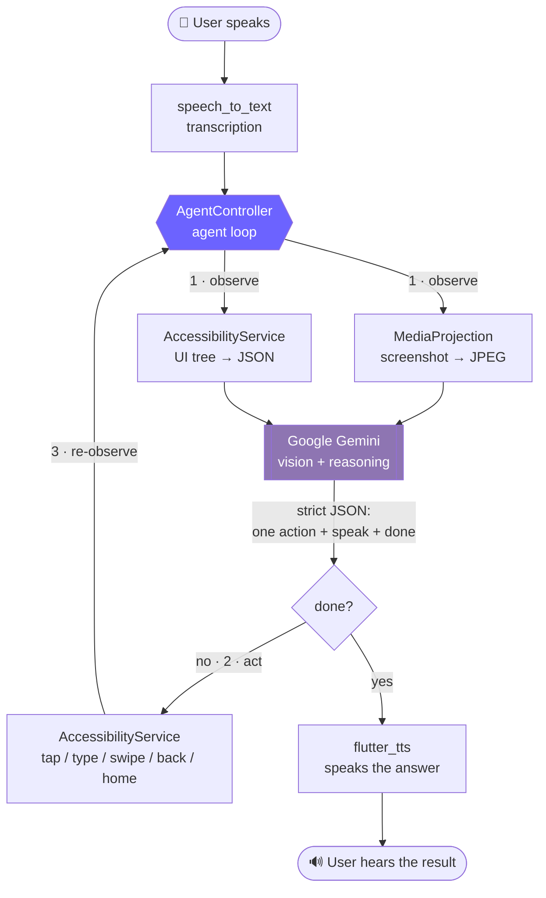

<div align="center">

# 🔮 Lucy

### Your screen-aware AI companion for Android

**Lucy sees your screen, understands what's on it, and taps, types and swipes for you — all from a voice command.**

[](https://github.com/alzin/lucy-screen-agent/actions/workflows/ci.yml)
[](LICENSE)
[](https://flutter.dev)
[](https://developer.android.com)
[](https://ai.google.dev)
[](CONTRIBUTING.md)

[Quick Start](#-quick-start) · [How It Works](#-how-it-works) · [Contributing](CONTRIBUTING.md) · [Troubleshooting](#-troubleshooting)

</div>

---

> [!IMPORTANT]
> Lucy is an **experimental research project**. To work, she needs two of the most powerful permissions Android offers: **screen capture** and an **accessibility service** that can tap and type on your behalf. Read [Privacy & Security](#-privacy--security) before you install, and prefer a spare or test device.

---

## 📖 Table of Contents

- [What is Lucy?](#-what-is-lucy)
- [Features](#-features)
- [How It Works](#-how-it-works)
- [Requirements](#-requirements)
- [Quick Start](#-quick-start)
- [Using Lucy](#-using-lucy)
- [Building a Release APK](#-building-a-release-apk)
- [Project Structure](#-project-structure)
- [Troubleshooting](#-troubleshooting)
- [Privacy & Security](#-privacy--security)
- [Roadmap](#-roadmap)
- [Contributing](#-contributing)
- [License](#-license)

---

## 🔮 What is Lucy?

Most voice assistants are limited to the apps their vendor integrated with. Lucy takes a different approach: instead of using APIs, **she uses the phone the way you do**.

Say *"Open WhatsApp and send Sarah a message saying I'm running late."* Lucy will:

1. 👂 Transcribe your voice
2. 📸 Take a screenshot of whatever is currently on screen
3. 🌲 Read the Android **accessibility tree** — every button, label and text field with exact pixel bounds
4. 🤖 Send the screenshot **and** the UI tree to Google Gemini, which replies with a single next action
5. ⚡ Execute that action through the accessibility service — a real tap, a real keystroke
6. 🔁 Take a fresh screenshot and repeat until the task is done
7. 🔊 Speak the result back to you, in your language

Because Lucy works at the screen level, she works with **any app on your phone** — no integration required.

---

## ✨ Features

| | |
|---|---|
| 🗣️ **Voice-driven** | Speech-to-text in, text-to-speech out. No typing required. |
| 👁️ **Screen-aware** | Combines a JPEG screenshot with a structured accessibility tree, so the model sees *and* reads the screen. |
| 🎯 **No hallucinated taps** | The model taps elements **by ID**, never by guessed coordinates. Real pixel bounds are resolved on the Dart side from the accessibility tree. |
| 🌍 **Trilingual** | English 🇬🇧, Japanese 🇯🇵 and Arabic 🇸🇦 — with language detection and matching TTS/STT locales. |
| 🔄 **Agentic loop** | Observe → decide → act → re-observe, up to 50 steps per command. |
| 🛑 **Always interruptible** | A persistent "Stop Lucy" notification cancels the agent instantly, even while she's inside another app. |
| 🎨 **Live transcript** | Every screenshot, action and reply is shown in a scrollable conversation view. |
| 🔑 **Bring your own key** | Your Gemini API key stays on your device. No backend, no telemetry, no account. |

---

## 🧠 How It Works



### The two sources of truth

Vision alone is unreliable for UI automation — models guess coordinates and miss by 40 pixels. Lucy solves this by giving Gemini **both** a picture and a map:

```jsonc
// What Gemini receives alongside the screenshot
{
  "package": "com.whatsapp",
  "elements": [
    { "id": 5, "type": "Button", "text": "Send", "clickable": true,
      "bounds": { "cx": 1012, "cy": 2180, "w": 120, "h": 120 } },
    { "id": 6, "type": "EditText", "desc": "Type a message", "editable": true,
      "bounds": { "cx": 520, "cy": 2180, "w": 860, "h": 120 } }
  ]
}
```

Gemini replies with `{"type": "tap", "element": 5}` — an **ID**, not a coordinate. Lucy looks up the real bounds and dispatches a gesture there. This single design choice is what makes the agent reliable.

### Available actions

| Action | Parameters | Effect |
|---|---|---|
| `open_app` | `package` | Launch an app by package name |
| `tap` | `element` | Tap the accessibility element with that ID |
| `type` | `text` | Type into the focused input field |
| `swipe` | `startX`, `startY`, `endX`, `endY` | Scroll or swipe |
| `back` | — | Press the system back button |
| `home` | — | Press the system home button |
| `wait` | `ms` | Pause before the next observation |

After each action Lucy waits for the screen to actually settle — a package change, a UI-tree change, or a newly focused text field — instead of sleeping a fixed amount of time.

---

## 📋 Requirements

| | Minimum | Notes |
|---|---|---|
| **Flutter** | Dart SDK `^3.11.1` | Verified on Flutter `3.47.1` / Dart `3.13.1` |
| **Android device** | Android 7.0 (API 24) | Targets API 36. **A physical device is strongly recommended** — emulators often lack a usable STT/TTS engine |
| **JDK** | 17 | Bundled with recent Android Studio |
| **Gemini API key** | free tier works | Get one at [aistudio.google.com](https://aistudio.google.com/app/apikey) |

> [!NOTE]
> **Android only.** Screen capture and the action layer are implemented in Kotlin against Android APIs. There is no iOS target — iOS does not permit this kind of system-wide control.

---

## 🚀 Quick Start

### Step 1 — Install Flutter

If you don't have Flutter yet, follow the [official install guide](https://docs.flutter.dev/get-started/install), then verify your setup:

```bash
flutter doctor
```

Make sure the **Android toolchain** row has a green check. Everything else (iOS, web, desktop) is irrelevant for Lucy.

### Step 2 — Clone the repository

```bash
git clone https://github.com/alzin/lucy-screen-agent.git
```

```bash
cd lucy-screen-agent
```

### Step 3 — Install dependencies

```bash
flutter pub get
```

### Step 4 — Connect your Android device

1. On your phone, open **Settings → About phone** and tap **Build number** seven times to unlock Developer options.
2. Go to **Settings → Developer options** and enable **USB debugging**.
3. Plug the phone into your computer and accept the debugging prompt.
4. Confirm your computer can see it:

```bash
flutter devices
```

### Step 5 — Run the app

```bash
flutter run
```

The first build downloads Gradle dependencies and can take several minutes. Later runs are much faster.

### Step 6 — Get a Gemini API key

1. Open [Google AI Studio](https://aistudio.google.com/app/apikey).
2. Sign in and click **Create API key**.
3. Copy the key — it starts with `AIza...`.

### Step 7 — Add your key to Lucy

In the app, tap the 🔑 **key icon** in the top bar, paste your key and hit **Save**. It is stored locally with `shared_preferences` and never leaves your device except in requests to Google's Gemini API.

### Step 8 — Enable the accessibility service

Lucy cannot start without this — it's how she taps and types.

1. The app shows an **"Accessibility Required"** screen on first launch. Tap **Open Settings**.
2. Navigate to **Installed apps** (wording varies by manufacturer) **→ Lucy**.
3. Toggle it **on** and accept the system warning.
4. Return to Lucy with the back button — she detects the change automatically.

### Step 9 — Grant screen capture

Tap the 🎤 **microphone button**. Android shows a **"Start recording or casting?"** dialog — tap **Start now**. This grants the `MediaProjection` permission Lucy uses to screenshot.

### Step 10 — Talk to her

Say something like:

> *"Open the calculator and work out 47 times 12."*

Watch the conversation view fill up with screenshots and actions. 🎉

---

## 🎮 Using Lucy

### Example commands

| | Command |
|---|---|
| 📱 | *"Open YouTube and search for lofi hip hop."* |
| ⚙️ | *"Go to settings and turn on Bluetooth."* |
| 👀 | *"What's on my screen right now?"* |
| 💬 | *"Open WhatsApp and message Mom that I'll call tonight."* |
| ⏰ | *"Set an alarm for 7 in the morning."* |

Lucy asks *"Do you need any further help?"* after each completed task. Answer **"no"** (or "stop", "nothing") and she shuts down cleanly.

### Switching language 🌍

Tap the 🌐 **language selector** in the top bar to pick **English**, **日本語** or **العربية**. This sets the speech-recognition locale.

Lucy also **detects the language you actually spoke** and replies in it — the AI tags each response with a language code, and the app switches its TTS voice and follow-up prompts to match. Your choice persists across restarts.

### Stopping the agent 🛑

Three ways, in order of urgency:

1. **The red stop button** in the app — tap the mic button while she's running.
2. **The "Stop Lucy" notification** — swipe down from anywhere, even inside another app, and tap **Stop Lucy**. This is the one you want when she's off doing something in a different app.
3. **Force-stop the app** from Android settings — the nuclear option.

Lucy also stops herself automatically after **50 steps** on a single command, so she can never loop forever.

---

## 📦 Building a Release APK

Debug builds work fine for trying Lucy out. For a signed release build:

<details>
<summary><b>1. Create a keystore</b></summary>

```bash
keytool -genkey -v -keystore lucy-release.jks -keyalg RSA -keysize 2048 -validity 10000 -alias lucy
```

</details>

<details>
<summary><b>2. Create <code>android/key.properties</code></b></summary>

```properties
storePassword=<your store password>
keyPassword=<your key password>
keyAlias=lucy
storeFile=<absolute path to lucy-release.jks>
```

> [!WARNING]
> `key.properties` and `*.jks` are already in `.gitignore`. **Never commit them.** Anyone with your keystore can publish updates impersonating your app.

</details>

<details>
<summary><b>3. Build</b></summary>

```bash
flutter build apk --release
```

The APK lands in `build/app/outputs/flutter-apk/app-release.apk`.

For Play Store distribution, build an App Bundle instead:

```bash
flutter build appbundle --release
```

</details>

---

## 📁 Project Structure

```
lucy-screen-agent/
├── lib/
│   ├── main.dart                          # App entry point, theme, LucyApp widget
│   ├── screens/
│   │   └── home_screen.dart               # Conversation UI, mic button, API-key dialog,
│   │                                      # accessibility gate, language selector
│   └── services/
│       ├── agent_controller.dart          # ⭐ The brain: agent loop, state machine,
│       │                                  #    action execution, language handling
│       ├── ai_service.dart                # Gemini client, system prompt, JSON parsing
│       ├── voice_service.dart             # speech_to_text + flutter_tts wrapper
│       └── screen_capture_service.dart    # Dart side of the platform channel
│
├── android/app/src/main/kotlin/com/poc/screen_aware_ai/
│   ├── MainActivity.kt                    # Method-channel host, MediaProjection consent
│   ├── ScreenCaptureService.kt            # Foreground service: VirtualDisplay → JPEG
│   ├── ScreenActionService.kt             # AccessibilityService: UI tree + gestures
│   └── OverlayService.kt                  # Persistent "Stop Lucy" notification
│
├── test/                                  # Widget tests
└── docs/ARCHITECTURE.md                   # Deep dive for contributors
```

**Data flow in one line:** `home_screen.dart` → `agent_controller.dart` → (`ai_service.dart` ⇄ Gemini) → `screen_capture_service.dart` → `MethodChannel` → Kotlin services → Android.

📚 New contributors should read **[docs/ARCHITECTURE.md](docs/ARCHITECTURE.md)** — it explains the agent loop, the platform-channel contract, and how to add a new action.

---

## 🔧 Troubleshooting

<details>
<summary><b>"Accessibility Required" screen won't go away</b></summary>

Some manufacturers (Xiaomi, Oppo, Vivo, Samsung) bury accessibility toggles or silently revoke them.

- Look under **Settings → Accessibility → Installed apps / Downloaded apps → Lucy**.
- On MIUI/ColorOS you may also need to disable battery optimisation for Lucy and enable **Autostart**.
- Fully close and reopen the app after enabling — Lucy re-checks on resume, but a cold start is a reliable reset.

</details>

<details>
<summary><b>"Screen capture permission denied" or blank screenshots</b></summary>

- Tap the mic button again and accept the **"Start now"** dialog.
- On Android 14+, the MediaProjection token is **single-use**. If you switch away for a long time, Lucy re-requests permission automatically — accept it again.
- Some apps set `FLAG_SECURE` (banking apps, Netflix) and their screens come back black. This is enforced by Android and cannot be worked around.

</details>

<details>
<summary><b>Lucy doesn't hear me / listening times out</b></summary>

- Grant the **microphone** permission (Android asks on first use).
- Make sure a speech-recognition engine is installed — usually the *Google* app → **Settings → Voice**.
- Check that the language selected in the top bar matches the language you're speaking; the STT locale is set from it.
- Lucy retries listening 3 times, then stops and asks you to tap the mic again.

</details>

<details>
<summary><b>"⚠️ Please set your Gemini API key first"</b></summary>

Tap the 🔑 icon and paste a valid key from [AI Studio](https://aistudio.google.com/app/apikey). If it still fails, your key may be rate-limited or restricted — check the quota page in AI Studio.

</details>

<details>
<summary><b>Lucy taps the wrong thing</b></summary>

This usually means the accessibility tree is incomplete — some apps (games, or apps with poor semantics) expose very little. Check the conversation view: if the action summary shows a `tap` on an element that doesn't match, the UI tree given to the model was misleading. Please [open an issue](https://github.com/alzin/lucy-screen-agent/issues) with the app name and what you asked for.

</details>

<details>
<summary><b>Gradle build fails on first run</b></summary>

- Confirm JDK 17: `java -version`.
- Wipe and retry: `flutter clean`, then `flutter pub get`, then `flutter run`.
- `android/local.properties` is generated by Flutter and gitignored — if it's missing, running `flutter run` once recreates it.

</details>

---

## 🔐 Privacy & Security

Please read this before installing. Lucy is powerful precisely because she has deep access.

**What leaves your device**

- 📸 **Screenshots** (downscaled to max 1280px, JPEG quality 72) are sent to the **Google Gemini API** on every step of an active task.
- 🌲 The **accessibility tree** — including any text visible on screen — is sent with them.
- 🎤 **Voice** is transcribed by Android's speech recognizer, subject to your device's own settings.

**What does not**

- Lucy has **no backend**. There is no analytics, no crash reporting, no account, no server operated by this project.
- Your **API key** is stored locally in `shared_preferences` and only ever sent to Google.

**What this means in practice**

> [!CAUTION]
> While a task is running, **anything visible on your screen may be sent to Google** — including messages, emails, banking screens and notifications. The accessibility service can also read text fields and dispatch taps. Don't run Lucy while sensitive information is on screen, and review [Google's Gemini API terms](https://ai.google.dev/gemini-api/terms) to understand how prompt data is handled on your tier.

**Recommendations**

- ✅ Use a spare device, a test profile, or Android's Work Profile.
- ✅ Stop Lucy (via the notification) before opening anything sensitive.
- ✅ Revoke the accessibility service when you're not actively using the app.
- ❌ Never commit your API key, keystore, or `key.properties`.

Found a security issue? Please read **[SECURITY.md](SECURITY.md)** — don't open a public issue.

---

## 🗺️ Roadmap

Ideas that would make great contributions. Comment on an issue or open one to claim it:

- [ ] 🔒 **Confirmation gate** for destructive actions (sending messages, purchases, deletions)
- [ ] 🧩 **Pluggable AI backends** — OpenAI, Anthropic, or a local model behind the `AiService` interface
- [ ] 🚫 **App allowlist/blocklist** so Lucy can never touch chosen apps
- [ ] 💾 **Persistent conversation history** across restarts
- [ ] 🌐 **More languages** (see [CONTRIBUTING.md](CONTRIBUTING.md#-adding-a-language) — it's a ~20-line change)
- [ ] 🧪 **Test coverage** for the `AgentController` state machine
- [ ] 📊 **Token/cost counter** in the UI
- [ ] ♿ **Better UI-tree extraction** for apps with weak accessibility semantics

---

## 🤝 Contributing

**Contributions are very welcome** — this project is early and there's a lot of low-hanging fruit.

👉 Start with **[CONTRIBUTING.md](CONTRIBUTING.md)**. It covers the dev setup, code style, the PR process, and walkthroughs for adding a new agent action or language.

Good first issues are labelled [`good first issue`](https://github.com/alzin/lucy-screen-agent/labels/good%20first%20issue).

By participating you agree to the [Code of Conduct](CODE_OF_CONDUCT.md).

---

## 📄 License

Released under the [MIT License](LICENSE).

---

<div align="center">

**Built with Flutter and Google Gemini.**

If Lucy is useful to you, consider leaving a ⭐ — it genuinely helps others find the project.

[Report a bug](https://github.com/alzin/lucy-screen-agent/issues/new?template=bug_report.yml) · [Request a feature](https://github.com/alzin/lucy-screen-agent/issues/new?template=feature_request.yml)

</div>
