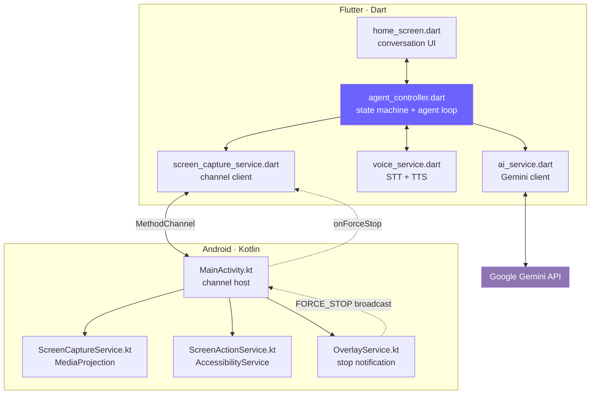
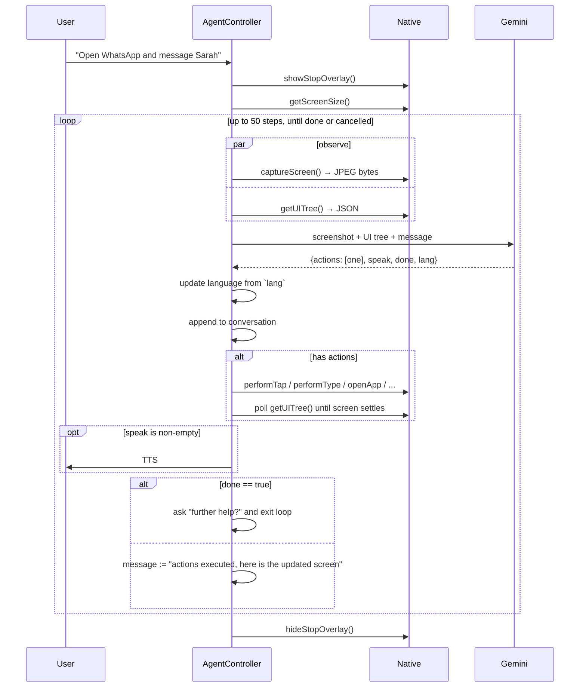
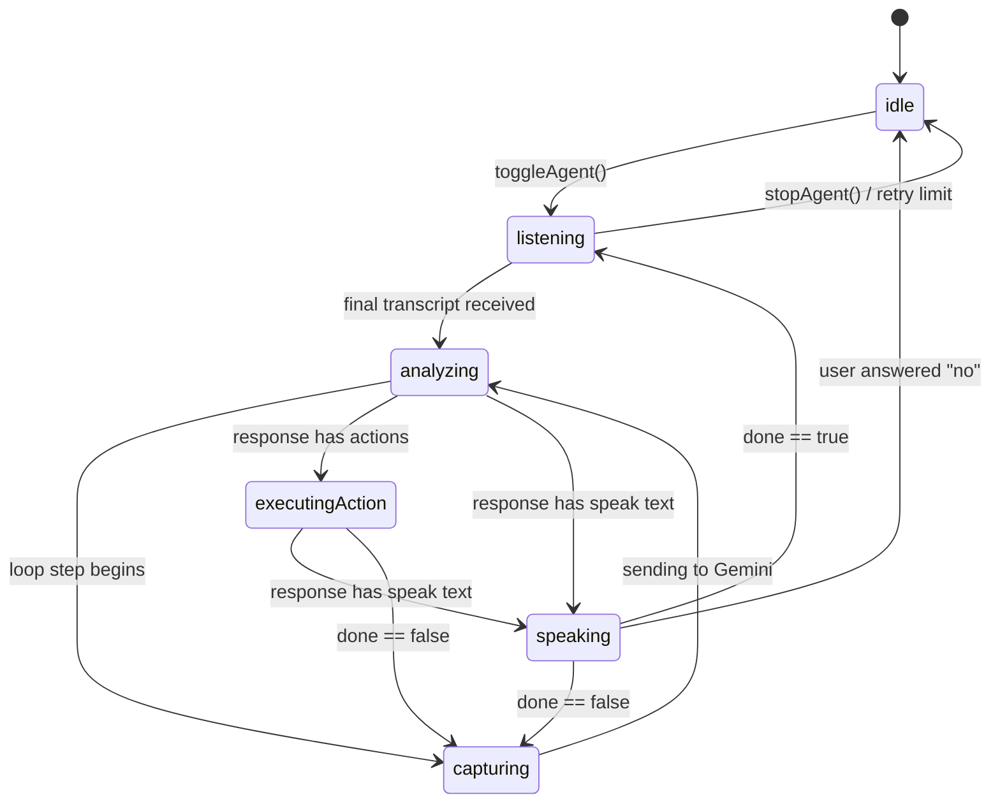

# Architecture

A deep dive into how Lucy works, for people who want to change her behaviour. If you just want to run the app, the [README](../README.md) is enough.

- [The big picture](#the-big-picture)
- [The agent loop](#the-agent-loop)
- [The state machine](#the-state-machine)
- [The platform channel](#the-platform-channel)
- [Screen capture](#screen-capture)
- [The accessibility service](#the-accessibility-service)
- [Why tap-by-element](#why-tap-by-element)
- [Readiness detection](#readiness-detection)
- [Language handling](#language-handling)
- [Cancellation](#cancellation)
- [Known limitations](#known-limitations)

---

## The big picture

Lucy is a Flutter app with a Kotlin layer that does everything Flutter cannot: capture the screen, read the accessibility tree, and dispatch real touch gestures.



There is exactly one `AgentController`, created in `main.dart` and passed down to `HomeScreen`. It's a `ChangeNotifier`; the UI rebuilds on `notifyListeners()`. No state-management package is involved, deliberately — the app has one piece of state and one owner.

---

## The agent loop

`AgentController._runAgentLoop()` is the heart of the project. It runs at most **50 steps** (`_maxStepsPerCommand`) per user command.



Key properties:

**One action per step.** The system prompt insists on exactly one action per response. Batching sounds faster but is much less reliable — the model would be planning against a screen that no longer exists after action one. The cost is more round trips; the benefit is that every decision is made against a fresh observation.

**Screenshot and UI tree are fetched concurrently.** Both futures start before either is awaited (`_captureScreenWithRetry()` and `_fetchUiSnapshot()`), which saves roughly the cost of the slower one per step.

**Capture is retried.** After navigating to a new app, the `VirtualDisplay` often hasn't rendered a frame yet, so the first capture returns null. `_captureScreenWithRetry()` makes up to 3 attempts.

**`done` drives the exit.** When Gemini sets `done: true`, Lucy appends the localized "Do you need any further help?" prompt, sets `_isAskingForFurtherHelp`, and breaks out of the loop back into listening.

---

## The state machine

`AgentState` has seven values. The UI derives its status bar icon and colour from the current one.



`waitingConfirmation` exists in the enum and has UI treatment, but nothing sets it yet — it's the hook for the [confirmation gate](../CONTRIBUTING.md#-good-first-issues) on the roadmap.

Two guards keep the loop from spinning forever:

- `_maxListenRetries = 3` — if speech recognition returns empty three times in a row, Lucy stops and asks you to tap the mic.
- `_maxStepsPerCommand = 50` — a hard ceiling on agent steps per command.

---

## The platform channel

One `MethodChannel`, named `com.poc.screen_aware_ai/screen`, hosted by `MainActivity`.

### Flutter → Native

| Method | Args | Returns | Backed by |
|---|---|---|---|
| `requestScreenCapture` | — | `bool` | `MediaProjectionManager` consent dialog |
| `captureScreen` | — | `Uint8List` (JPEG) | `ScreenCaptureService` |
| `getUITree` | — | `String` (JSON) | `ScreenActionService` |
| `isAccessibilityEnabled` | — | `bool` | `ScreenActionService.instance != null` |
| `openAccessibilitySettings` | — | — | System settings intent |
| `getScreenSize` | — | `{width, height}` | `ScreenCaptureService` or `WindowManager` |
| `openApp` | `packageName` | `bool` | Launch intent |
| `performTap` | `x`, `y` | `bool` | `ScreenActionService` gesture |
| `performType` | `text` | `bool` | `ACTION_SET_TEXT` on the focused node |
| `performSwipe` | `startX`, `startY`, `endX`, `endY` | `bool` | `ScreenActionService` gesture |
| `pressBack` / `pressHome` | — | `bool` | Global accessibility actions |
| `showStopOverlay` / `hideStopOverlay` | — | `bool` | `OverlayService` |

### Native → Flutter

| Method | Meaning |
|---|---|
| `onForceStop` | The user tapped **Stop Lucy** in the notification |

`ScreenCaptureManager._ensureHandler()` registers the reverse handler lazily, the first time the stop overlay is shown.

### Error codes

`captureScreen` can fail with two `PlatformException` codes, and the Dart side treats them differently:

- **`NOT_INITIALIZED`** — the service is alive but lost its projection. Wait 800 ms, retry once, then fall back to re-requesting permission.
- **`NO_SERVICE`** — the service isn't running at all. Re-request permission immediately.

This matters on **Android 14+**, where a `MediaProjection` token is single-use and cannot be replayed after the service is torn down. `MainActivity` stores `projectionResultCode` / `projectionData` to attempt a silent restart, and surfaces these codes when that fails.

> [!NOTE]
> `Activity.RESULT_OK` is `-1`, so `0` is used as the "no result yet" sentinel throughout `MainActivity` and `ScreenCaptureService`. Using `-1` as a default here is a real bug that has been fixed once already — don't reintroduce it.

---

## Screen capture

`ScreenCaptureService` is a foreground service of type `mediaProjection`.

```
MediaProjection → VirtualDisplay → ImageReader → Bitmap → downscale → JPEG bytes
```

- Runs entirely on a dedicated `HandlerThread` named `ScreenCaptureWorker`. Bitmap conversion and JPEG encoding never touch the main thread.
- Images are downscaled so the longest edge is at most **1280 px** (`MAX_UPLOAD_DIMENSION`) and encoded at **JPEG quality 72** (`JPEG_QUALITY`). This is the single biggest lever on latency and token cost — raising it makes the model marginally more accurate and every step noticeably slower.
- Bytes are returned **in memory**. Nothing is written to disk; there is no screenshot file to leak or clean up.
- A `projectionGeneration` counter guards against callbacks from a torn-down projection landing on a new one.

---

## The accessibility service

`ScreenActionService` extends `AccessibilityService` and does two jobs.

### 1. Reading the screen

`getUITree()` walks the node tree from `rootInActiveWindow` and emits JSON:

```jsonc
{
  "package": "com.whatsapp",
  "elements": [
    {
      "id": 5,                 // index — the model references this
      "type": "Button",        // simplified class name
      "text": "Send",          // omitted when blank
      "desc": "Send message",  // content description, omitted when blank
      "clickable": true,       // flags only present when true
      "editable": false,
      "focused": false,
      "scrollable": false,
      "bounds": { "cx": 1012, "cy": 2180, "w": 120, "h": 120 }
    }
  ]
}
```

Flags are **omitted when false**, which keeps the payload small — this JSON goes into every prompt, so every byte is a token.

If the active window yields a suspiciously sparse tree, the service falls back to walking **all** windows. This handles dialogs, keyboards and overlays that live outside the active window.

### 2. Acting on the screen

- **Tap / swipe** — `dispatchGesture()` with a `GestureDescription`. Wrapped in `dispatchGestureSync()`, which blocks on a `CountDownLatch` for up to 2 seconds so callers know whether the gesture actually landed.
- **Type** — `ACTION_SET_TEXT` on the focused editable node.
- **Back / home** — `performGlobalAction()`.

Because `dispatchGestureSync` blocks, `MainActivity` runs these on a background `Thread` and returns the result via `runOnUiThread`. Calling them directly on the platform thread would deadlock the channel.

---

## Why tap-by-element

This is the most important design decision in the project.

A vision model looking at a screenshot can describe the screen well but is **bad at pixel coordinates**. Ask it for the coordinates of the send button and it will be off by enough to hit the attachment icon instead.

So Lucy never lets the model pick coordinates:

1. The accessibility tree supplies exact bounds for every element.
2. The prompt gives the model those elements with integer `id`s.
3. The prompt states, in capitals, that taps must use `{"type": "tap", "element": <id>}` and never raw coordinates.
4. `_executeAction()` resolves the id back to real coordinates via `_resolveElementCoordinates()` and dispatches the gesture there.

The model chooses *what* to tap. The accessibility tree decides *where* that is. Hallucinated coordinates become structurally impossible.

There is still a raw-coordinate fallback in `_executeAction()` for the case where the model ignores the instruction or the element has vanished from the tree — it logs loudly when that path is taken. `swipe` remains coordinate-based, since scrolling targets a region rather than an element.

---

## Readiness detection

After an action, the screen needs time to change — but *how much* time varies wildly. A fixed `sleep` is either too slow or too flaky.

Instead, `_waitForActionReadiness()` polls the UI tree every 120 ms until it observes a real change, with a per-action deadline:

| Action | Timeout | Considered "ready" when |
|---|---|---|
| `open_app` | 2500 ms | Foreground package matches the target, or package/tree changed |
| `tap` | 900 ms | A text field gained focus (if the tap targeted an input), or package/tree changed |
| `type` | 900 ms | Package or tree changed |
| `swipe`, `back`, `home` | 1200 ms | Package or tree changed |
| `wait` | as requested, clamped to 10 s | — |

The tree "signature" is just the raw JSON string — if any element, text or bound moved, the string differs. Crude, but it costs nothing and catches everything.

If the accessibility service isn't enabled, readiness detection is skipped entirely (there is nothing to observe) and the loop proceeds with the previous snapshot.

---

## Language handling

Lucy supports `en`, `ja` and `ar`, and language flows through the system in two directions:

**User → app.** The language selector in the app bar sets `_currentLang`, which is persisted to `SharedPreferences` under `lucy_lang` and used to pick the STT locale (`en_US` / `ja_JP` / `ar_SA`). Changing it while listening restarts the recogniser so the new locale takes effect immediately.

**Model → app.** The system prompt instructs Gemini to reply in whatever language the user spoke and to tag the response with `"lang": "en" | "ja" | "ar"`. `_runAgentLoop()` reads that tag, updates `_currentLang`, and persists it. That switches the TTS voice, the follow-up prompt, and the next STT locale.

Two strings are hardcoded per language rather than coming from the model — the follow-up question (`_followUps`) and the stop confirmation (`_stoppingMessages`) — plus a regex per language (`_negativeEn`, `_negativeJa`, `_negativeAr`) for recognising "no, I'm done" when Lucy asks whether you need further help.

Only `speak` is localized. Action JSON keys and values stay in English so parsing never depends on locale.

---

## Cancellation

Stopping a screen-controlling agent has to work even when the agent is inside another app, so cancellation has three independent paths:

1. **In-app** — tapping the mic button while active calls `stopAgent()`.
2. **Notification** — `OverlayService` posts a persistent notification with a **Stop Lucy** action. Tapping it broadcasts `com.poc.screen_aware_ai.FORCE_STOP`, which `MainActivity` receives and forwards to Flutter as `onForceStop`, which calls `requestCancel()`.
3. **Step ceiling** — the loop exits on its own after 50 steps.

`_cancelRequested` is checked at **nine** points inside a single loop iteration — after capture, after the UI tree, after the model call, between actions, after speaking. This is why cancellation feels instant instead of waiting for the current step to finish.

`requestCancel()` also stops TTS immediately, so Lucy goes quiet the moment you tap.

---

## Known limitations

Worth knowing before you file a bug — these are structural, not oversights:

- **`FLAG_SECURE` screens capture as black.** Banking apps, DRM video. Enforced by Android; no workaround exists.
- **Apps with poor accessibility semantics are hard to drive.** Many games and some cross-platform apps expose almost nothing to the tree. Lucy still has the screenshot, but tap-by-element degrades.
- **Every step is a full round trip.** Screenshot + tree + inference means multi-second steps. A ten-step task takes a while, by design.
- **No confirmation gate.** Lucy will send a message or delete something if asked. This is the highest-priority item on the roadmap.
- **Chat history grows unbounded within a task.** `AiService` uses a single `ChatSession` per command; long tasks accumulate context, cost and latency. `resetChat()` exists but is only called when you clear the conversation, never mid-task.
- **Android only.** iOS provides no equivalent to `AccessibilityService` gesture dispatch, and never will.

---

## Where to start reading

If you're new to the codebase, read in this order:

1. [`lib/services/ai_service.dart`](../lib/services/ai_service.dart) — start with `_systemPrompt`. It's the contract between Lucy and the model, and it explains the shape of everything else.
2. [`lib/services/agent_controller.dart`](../lib/services/agent_controller.dart) — `_runAgentLoop()`, then `_executeAction()`.
3. [`android/.../ScreenActionService.kt`](../android/app/src/main/kotlin/com/poc/screen_aware_ai/ScreenActionService.kt) — `getUITree()` to see what the model actually receives.

Everything else is plumbing.
