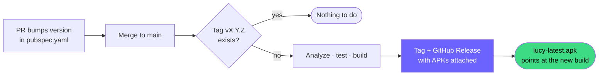

# Releasing Lucy

How a new version of Lucy reaches the people who want to install her.

Releases are automated. You never build or upload an APK by hand — you bump a
version number, and merging that to `main` does the rest.

---

## 📋 Table of Contents

- [How it works](#how-it-works)
- [Cutting a release](#cutting-a-release)
- [What gets published](#what-gets-published)
- [The permanent download link](#the-permanent-download-link)
- [Version numbers](#version-numbers)
- [Pre-releases](#pre-releases)
- [Signing](#signing)
- [When something goes wrong](#when-something-goes-wrong)

---

## How it works

[`.github/workflows/release.yml`](../.github/workflows/release.yml) runs on every
push to `main`. Its first job reads `version:` out of `pubspec.yaml` and asks one
question:

> Does a tag named `v<that version>` already exist?

- **Yes** → nothing happens. The overwhelming majority of merges land here.
- **No** → the release job runs: analyze, test, build, tag, publish.

So the **version bump is the trigger, not the merge**. Merging ten PRs that don't
touch `pubspec.yaml` produces zero releases. Merging one that changes
`version: 0.1.0+1` to `version: 0.2.0+2` produces exactly one.

That matters, because it means cutting a release is a reviewable change like any
other. The release notes, the version, and the code all arrive in the same pull
request.



---

## Cutting a release

1. **Branch** off `main`.

2. **Bump the version** in [`pubspec.yaml`](../pubspec.yaml):

   ```yaml
   version: 0.2.0+2
   ```

   The part before `+` is the version users see (`versionName`, and the tag).
   The part after `+` is the Android `versionCode` — an integer that **must
   increase on every release**, or Android will refuse to install the update.
   Just add one each time.

3. **Move the `Unreleased` notes** in [`CHANGELOG.md`](../CHANGELOG.md) into a new
   section headed exactly:

   ```markdown
   ## [0.2.0] - 2026-09-14
   ```

   The heading format matters — the workflow copies everything under it into the
   release notes on GitHub. Add the two link definitions at the bottom of the file
   too.

4. **Open a PR, get it reviewed, merge it.**

5. **Watch [Actions](https://github.com/alzin/lucy-screen-agent/actions).** A few
   minutes later the release appears under
   [Releases](https://github.com/alzin/lucy-screen-agent/releases).

You can also trigger the workflow by hand from the Actions tab
(**Release → Run workflow**) — useful if a run failed for an infrastructure
reason. It re-checks the tag, so it will not publish twice.

---

## What gets published

Each release carries these assets:

| Asset | Notes |
|---|---|
| `lucy-latest.apk` | Universal build under a **fixed name**. This is what the README and the repo's About link point at. Stable releases only. |
| `lucy-vX.Y.Z-arm64-v8a.apk` | What almost everyone should download — every Android phone from roughly 2017 onwards. Smallest. |
| `lucy-vX.Y.Z-universal.apk` | Every CPU variant in one file. Larger, but installs anywhere. |
| `lucy-vX.Y.Z-armeabi-v7a.apk` | Older 32-bit devices. |
| `lucy-vX.Y.Z-x86_64.apk` | Emulators and x86 tablets. |
| `SHA256SUMS.txt` | Checksums for all of the above. |

The release body is assembled from the CHANGELOG section for that version, plus
install instructions, the privacy warning, and a signing note.

> [!NOTE]
> **Releases, not Packages.** GitHub Releases attach files to a git tag — exactly
> the right home for an APK a human downloads and installs. GitHub Packages is a
> registry for artifacts a *package manager* pulls (npm, Maven, NuGet, container
> images). Nothing consumes Lucy that way, so this project does not use Packages.

---

## The permanent download link

Because `lucy-latest.apk` keeps the same file name across releases, this URL
never changes and always redirects to the newest **stable** build:

```text
https://github.com/alzin/lucy-screen-agent/releases/latest/download/lucy-latest.apk
```

That is the link to put in the repo's **About** panel, in the README, and
anywhere else Lucy is announced. Pre-releases never take it over.

---

## Version numbers

[Semantic Versioning](https://semver.org/spec/v2.0.0.html), on a `0.x` line:

| Change | Bump |
|---|---|
| Bug fix, small tweak | `0.1.0` → `0.1.1` |
| New feature, new action, new language | `0.1.0` → `0.2.0` |
| Anything that breaks how Lucy is used or configured | `0.1.0` → `0.2.0` (allowed while `0.x`) |

`0.x` is deliberate: Lucy is experimental, and `0.x` says out loud that things may
still move. Reaching `1.0.0` should mean the agent loop, the action set and the
configuration have settled.

> Lucy's numbering restarted at `0.1.0`. Older `1.0.x` builds were private test
> builds distributed outside this repository — no tags or releases for them ever
> existed here.

---

## Pre-releases

A version with a hyphen is treated as a pre-release:

```yaml
version: 0.3.0-beta.1+7
```

It gets tagged and published like anything else, and is marked **Pre-release** on
GitHub — but it does **not** get a `lucy-latest.apk`, so the permanent link keeps
serving the last stable build. Testers grab the versioned file directly.

---

## Signing

### Today: the debug key

No release keystore is configured, so
[`android/app/build.gradle.kts`](../android/app/build.gradle.kts) falls back to
Android's debug signing key. The APKs install and run perfectly well, but the
signature is not stable between builds, which means:

- Users must **uninstall an older Lucy before installing a newer one**, otherwise
  Android rejects the update with `INSTALL_FAILED_UPDATE_INCOMPATIBLE`.
- The build is not suitable for the Play Store.

The release notes carry this warning automatically for as long as it is true.

### Upgrading to a real keystore

Do this once and every future release is signed with a stable identity — users can
then install updates straight over the top.

**1. Create the keystore** (keep the file somewhere safe and backed up — losing it
means never being able to update the app under the same signature again):

```bash
keytool -genkey -v -keystore lucy-release.jks -keyalg RSA -keysize 2048 -validity 10000 -alias lucy
```

**2. Base64-encode it:**

```bash
base64 -w0 lucy-release.jks > lucy-release.jks.base64
```

On macOS, `base64 -w0` is not supported — use `base64 -i lucy-release.jks | tr -d '\n' > lucy-release.jks.base64` instead.

**3. Add four repository secrets.** Each command prompts for the value, so nothing
sensitive ends up in your shell history:

```bash
gh secret set ANDROID_KEYSTORE_BASE64 < lucy-release.jks.base64
```

```bash
gh secret set ANDROID_KEYSTORE_PASSWORD
```

```bash
gh secret set ANDROID_KEY_ALIAS
```

```bash
gh secret set ANDROID_KEY_PASSWORD
```

**4. Delete `lucy-release.jks.base64`** and keep `lucy-release.jks` out of the
repo — `*.jks`, `*.keystore` and `android/key.properties` are gitignored.

The workflow picks the secrets up on the next run with no further changes: it
writes `android/key.properties`, Gradle finds it, and the debug-key warning
disappears from the release notes.

### For local release builds

Create [`android/key.properties`](../android/app/build.gradle.kts) yourself:

```properties
storePassword=<your store password>
keyPassword=<your key password>
keyAlias=lucy
storeFile=<absolute path to lucy-release.jks>
```

Without it, `flutter build apk --release` still works — it just prints a warning
and uses the debug key.

> [!NOTE]
> **Play Store, later.** Play App Signing keeps its own app signing key; the
> keystore above would become the *upload* key. Note also that `applicationId` is
> currently `com.poc.screen_aware_ai` — a package name that has already been
> published to one Play account cannot be reused on a different one, and `com.poc`
> is a leftover from the prototype. Worth changing before any Play submission,
> though it is a breaking change for anyone already running an APK from here.

---

## When something goes wrong

**The run failed after the tag was created.** `gh release create` makes the tag and
the release together, so a failure before that step leaves nothing behind — fix
the problem and re-run. If a tag does exist without a release, delete it and
re-run the workflow:

```bash
git push --delete origin vX.Y.Z
```

**A bad build got published.** Delete the release and its tag, fix forward, and
publish a new patch version. Do not re-use a version number that people may
already have downloaded:

```bash
gh release delete vX.Y.Z --cleanup-tag
```

**Nothing happened after merging.** Almost always the version wasn't bumped, or
the tag already existed. Open the workflow run — the `check` job prints exactly
what it read from `pubspec.yaml` and why it did or didn't publish.
